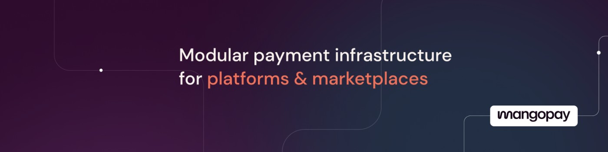

# ⚠️ Deprecated ⚠️

**Mangopay Checkout Android SDK is deprecated as of July 1, 2025, and will no longer be maintained or supported.**

We recommend using our **[Checkout Web SDK](https://docs.mangopay.com/sdks/checkout/web)** within a WebView as an alternative solution.  
A step-by-step integration guide is available [here](https://gist.github.com/jide-mangopay/3f96969bcb546f66507a7ac729cf4e39).

If you have any questions regarding this deprecation, please reach out to our team via the [Hub](https://hub.mangopay.com/).

<h1 align="center"> Mangopay Android Examples </h1>

